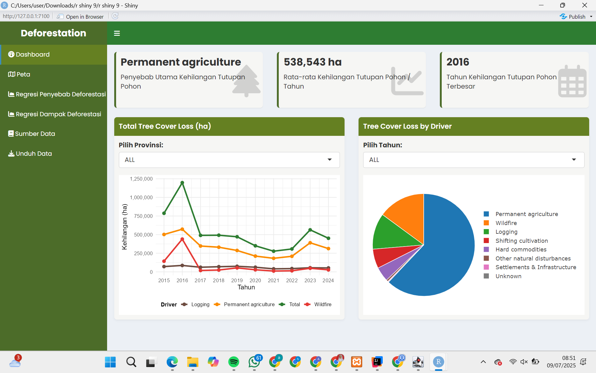
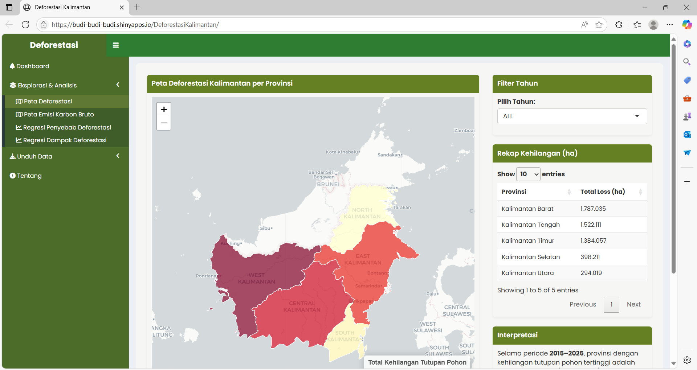
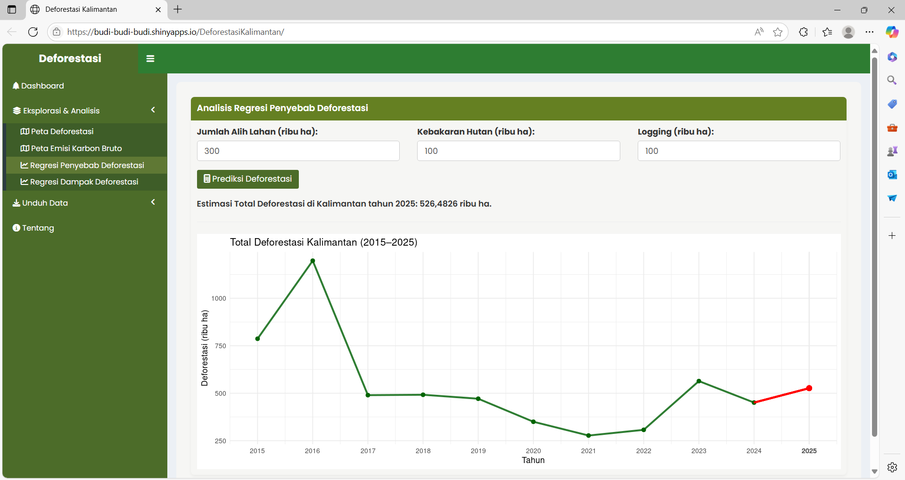

# 🌳 Deforestasi Kalimantan Dashboard

Dashboard interaktif berbasis **RShiny** untuk menganalisis tren deforestasi dan dampaknya di Pulau Kalimantan. Proyek ini dikembangkan sebagai bagian dari tugas mata kuliah Komputasi Statistik oleh mahasiswa Politeknik Statistika STIS.

📍 **https://budi-budi-budi.shinyapps.io/DeforestasiKalimantan/**

---

## 🖼️ Tampilan Dashboard

Berikut adalah tampilan visual dari dashboard yang dikembangkan menggunakan RShiny:

## 🧭 Deskripsi Singkat

Dashboard ini menyajikan data spasial dan temporal mengenai **kehilangan tutupan pohon**, **penyebab utama deforestasi**, dan **dampak lingkungan** seperti kualitas udara. Dengan fitur interaktif, pengguna dapat mengeksplorasi tren dan analisis regresi secara dinamis berdasarkan provinsi dan tahun.

---

## 🖥️ Fitur Utama

### 🧊 **Menu Sidebar**
- **Dashboard**: Ringkasan utama dengan:
  - 3 `valueBox`:
    - Driver utama kehilangan tutupan lahan
    - Rata-rata kehilangan tutupan pohon/tahun
    - Tahun dengan kehilangan tutupan pohon terbesar
  - `line chart` total tree cover loss 2015–2024 (terbagi per driver, filter provinsi)
  - `pie chart` tree cover loss by driver (filter tahun & provinsi)

- **Dropdown Menu**:
  - **Peta**: Visualisasi peta Kalimantan berdasarkan provinsi, menunjukkan data tree cover loss per tahun
  - **Regresi Penyebab Deforestasi**: Input 3 variabel X (kebakaran hutan, Jumlah alih lahan, dan Logging) untuk memprediksi nilai Y (tree cover loss)
  - **Regresi Dampak Deforestasi**: *[sedang dalam pengembangan]*
  - **Sumber Data**: Daftar sumber data
  - **Unduh Data**: *[sedang dalam pengembangan]*

---

## 📊 Sumber Data

Dashboard ini mengintegrasikan berbagai sumber resmi nasional dan internasional, di antaranya:

- [Global Forest Watch](https://www.globalforestwatch.org)
- [Badan Pusat Statistik (BPS)](https://www.bps.go.id)

---

## 🗂️ Struktur Proyek

    |── ui.R                                    # Tampilan antarmuka utama 
    |── server.R                                # Logika aplikasi
    |── global.R (opsional)                     # Objek global dan package
    |── data/                                   # Dataset mentah dan gambar
    |   └── indonesia-prov.geojson              # Data spasial wilayah Kalimantan
    |   └── deforestasi.xlsx                    # Dataset Kehilangan Tutupan Lahan di Kalimantan Tahun 2015-2024
    |   └── reg_sebab.xlsx                      # Data Variabel untuk Analisis Regresi

---

## 🛠️ Package R yang Digunakan

- `shiny` – Untuk membangun aplikasi web interaktif  
- `shinydashboard` – Untuk struktur layout dashboard  
- `ggplot2` – Untuk visualisasi data  
- `plotly` – Untuk membuat grafik interaktif  
- `dplyr` – Untuk manipulasi data  
- `readxl` – Untuk membaca file Excel  
- `leaflet` – Untuk menampilkan peta interaktif  
- `sf` – Untuk data spasial (shapefile, geojson, dll)  
- `scales` – Untuk formatting skala dan label pada grafik  
- `stringr` – Untuk manipulasi string  
- `htmltools` – Untuk komponen HTML tambahan dalam UI
- `tidy`
- `plm`

---

## 👩‍💻 Anggota Tim

- Arif Budiman
- Aura Hanifa Kasetya Putri
- M. Arkillah Ibnu A.  

---

## 🎯 Tujuan Dashboard

1. Menampilkan tren deforestasi 2015–2024 di Kalimantan berdasarkan provinsi  
2. Menyediakan analisis hubungan antara deforestasi dan variabel lingkungan  
3. Mempetakan tree cover loss dengan interaksi spasial  
4. Menjadi sarana edukatif berbasis data untuk publik dan pemangku kebijakan

---

## 📌 Catatan

Dashboard ini masih dalam tahap pengembangan aktif. Fitur "Regresi Dampak Deforestasi" akan segera tersedia.

---

## 📜 Lisensi

Proyek ini dikembangkan untuk tujuan edukasi oleh mahasiswa Politeknik Statistika STIS.  
Lisensi mengikuti standar akademik dan bersifat non-komersial.

