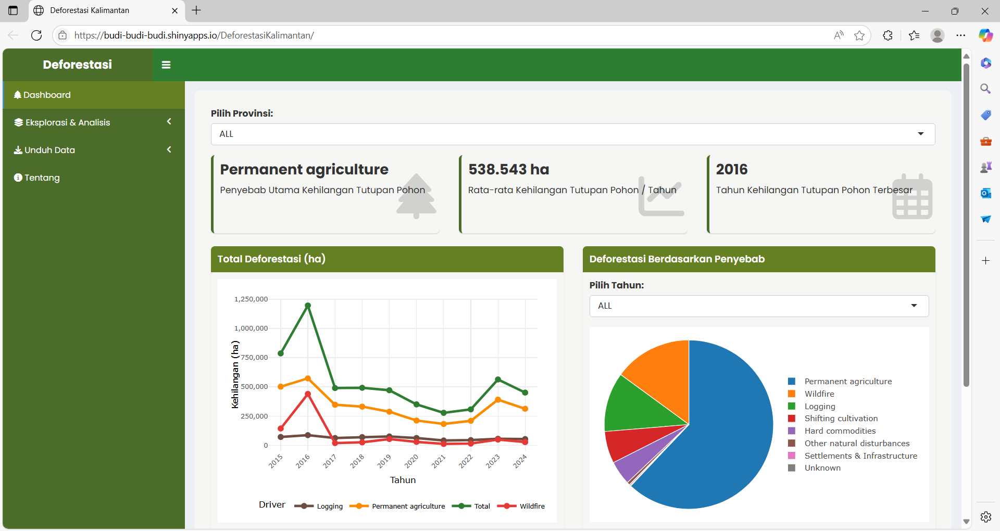
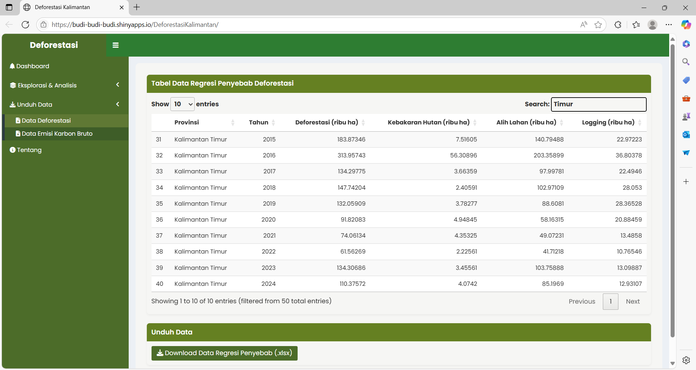
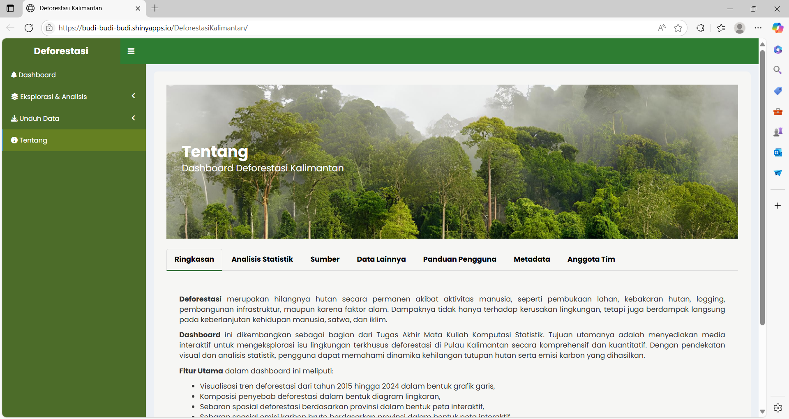

# 🌳 Deforestasi Kalimantan Dashboard

Dashboard interaktif berbasis **RShiny** untuk menganalisis tren deforestasi dan dampaknya di Pulau Kalimantan. Proyek ini dikembangkan sebagai bagian dari tugas mata kuliah Komputasi Statistik oleh mahasiswa Politeknik Statistika STIS.

📍 **https://budi-budi-budi.shinyapps.io/DeforestasiKalimantan/**

---

## 🖼️ Tampilan Dashboard

Berikut adalah tampilan visual dari dashboard yang dikembangkan menggunakan RShiny:

## 🧭 Deskripsi Singkat

Dashboard ini menyajikan data spasial dan temporal mengenai **kehilangan tutupan pohon**, **penyebab utama deforestasi**, dan **dampak lingkungan** yaitu **emisi karbon**. Dengan fitur interaktif, pengguna dapat mengeksplorasi tren dan analisis regresi secara dinamis berdasarkan provinsi dan tahun.

---

## 🖥️ Fitur Utama

### 🧊 **Menu Sidebar**
- **Dashboard**: Ringkasan utama dengan:
  - 3 `valueBox`:
    - Driver utama kehilangan tutupan lahan
    - Rata-rata kehilangan tutupan pohon/tahun
    - Tahun dengan kehilangan tutupan pohon terbesar
  - `line chart` total tree cover loss 2015–2024 (terbagi per driver, filter provinsi)
  - `pie chart` tree cover loss by driver (filter tahun & provinsi)

- **Dropdown Menu**:
  - **Peta Deforestasi**: Visualisasi peta Kalimantan berdasarkan provinsi, menunjukkan data tree cover loss per tahun
  - **Peta Emisi Karbon Bruto**: Visualisasi peta Kalimantan berdasarkan provinsi, menunjukkan data gross carbon emission loss per tahun
  - **Regresi Penyebab Deforestasi**: Input 3 variabel X (kebakaran hutan, Jumlah alih lahan, dan Logging) untuk memprediksi nilai Y (tree cover loss)
  - **Regresi Dampak Deforestasi**: Input variabel X (deforestasi) untuk memprediksi nilai Y (gross carbon emission)
  - **Unduh Data**: Download dataset untuk regresi penyebab dan regresi akibat deforestasi
  - **Tentang**: Informasi tambahan tentang Dashboard Deforestasi

---

## 📊 Sumber Data

Dashboard ini mengintegrasikan berbagai sumber resmi nasional dan internasional, di antaranya:

- [Global Forest Watch](https://www.globalforestwatch.org)
- [Badan Pusat Statistik (BPS)](https://www.bps.go.id)
- [Copernicus CDS](https://cds.climate.copernicus.eu)
---

## 🗂️ Struktur Proyek

    📁 r shiny 11/
    ├── 📁 Data/                         # Folder data utama
    │   ├── data_bps.xlsx               # Data statistik BPS
    │   ├── deforestasi.xlsx            # Data kehilangan tutupan pohon (2015–2024)
    │   ├── hujan.xlsx                  # Data curah hujan
    │   ├── suhu.xlsx                   # Data suhu 
    │   ├── reg_sebab.xlsx              # Data regresi penyebab deforestasi
    │   ├── regresi_akibat.xlsx         # Data regresi dampak deforestasi
    │   └── indonesia-prov.geojson      # Data spasial indonesia untuk peta interaktif
    ├── 📁 www/                          # Folder aset statis (gambar, css)
    │   ├── *.jpg / *.png               # Gambar untuk tampilan UI (foto tim, logo, dsb.)
    │   ├── style.css                   # Kustomisasi gaya CSS
    │   └── Analisis.pdf                # Dokumen analisis pendukung
    ├── global.R                        # Inisialisasi data global & pemanggilan library
    ├── ui.R                            # File antarmuka pengguna (User Interface)
    ├── server.R                        # Logika backend aplikasi (Server Logic)

---

## 🛠️ Package R yang Digunakan

- `shiny` – Untuk membangun aplikasi web interaktif  
- `shinydashboard` – Untuk struktur layout dashboard  
- `ggplot2` – Untuk visualisasi data  
- `plotly` – Untuk membuat grafik interaktif  
- `dplyr` – Untuk manipulasi data  
- `readxl` – Untuk membaca file Excel  
- `leaflet` – Untuk menampilkan peta interaktif  
- `sf` – Untuk data spasial (shapefile, geojson, dll)  
- `scales` – Untuk formatting skala dan label pada grafik  
- `stringr` – Untuk manipulasi string  
- `htmltools` – Untuk komponen HTML tambahan dalam UI
- `tidy`
- `plm`

---

## 👩‍💻 Anggota Tim

- Arif Budiman
- Aura Hanifa Kasetya Putri
- M. Arkillah Ibnu A.  

---

## 🎯 Tujuan Dashboard

1. Menampilkan tren deforestasi 2015–2024 di Kalimantan berdasarkan provinsi  
2. Menyediakan analisis hubungan antara deforestasi dan variabel lingkungan  
3. Mempetakan tree cover loss dan gross carbon emission dengan interaksi spasial  
4. Menjadi sarana edukatif berbasis data untuk publik dan pemangku kebijakan

---

## 📌 Catatan

Harap perhatikan bahwa meskipun data diperoleh dari sumber terpercaya, pengguna tetap disarankan untuk memverifikasi ulang jika digunakan untuk kebijakan atau publikasi resmi.

---

## 📜 Lisensi

Proyek ini dikembangkan untuk tujuan edukasi oleh mahasiswa Politeknik Statistika STIS.  
Lisensi mengikuti standar akademik dan bersifat non-komersial.

